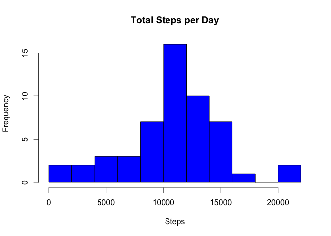
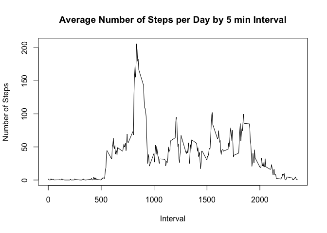
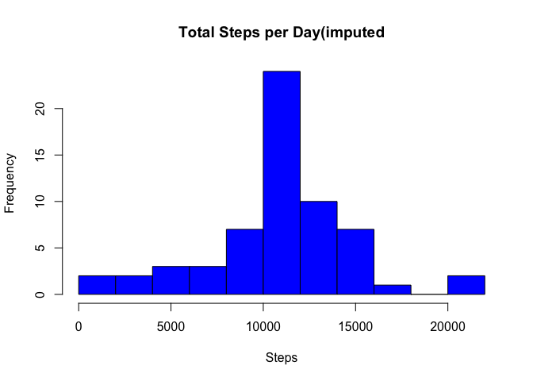

# Reproducible Research Project 1


## Introduction

It is now possible to collect a large amount of data about personal movement using activity monitoring devices such as a Fitbit, Nike Fuelband, or Jawbone Up. These type of devices are part of the “quantified self” movement – a group of enthusiasts who take measurements about themselves regularly to improve their health, to find patterns in their behavior, or because they are tech geeks. But these data remain under-utilized both because the raw data are hard to obtain and there is a lack of statistical methods and software for processing and interpreting the data.

This assignment makes use of data from a personal activity monitoring device. This device collects data at 5 minute intervals through out the day. The data consists of two months of data from an anonymous individual collected during the months of October and November, 2012 and include the number of steps taken in 5 minute intervals each day.

Set up the environment and load the CSV formatted file:


```r
library(dplyr)
```

```
## 
## Attaching package: 'dplyr'
```

```
## The following objects are masked from 'package:stats':
## 
##     filter, lag
```

```
## The following objects are masked from 'package:base':
## 
##     intersect, setdiff, setequal, union
```

```r
library(ggplot2)

activity <- read.csv("activity.csv")
```

## Process the Data and Plot a Histgram

The raw data is summarized per day to yield steps per day.  These values are displayed via histogram to determine the distribution of steps taken per day. 


```r
sumTable <- aggregate(activity$steps ~ activity$date, FUN=sum )
colnames(sumTable)<- c("Date", "Steps")

hist(sumTable$Steps, breaks=15, xlab="Steps", col="blue",  main = "Total Steps per Day")
```

<!-- -->

## Calculate Mean and Median of steps taken per day.


```r
mean(sumTable$Steps)
```

```
## [1] 10766.19
```

```r
median(sumTable$Steps)
```

```
## [1] 10765
```

# What is the Average Daily Activity Pattern?

A time series of the  average 5-minute intervals is plotted, with the largest 5-minute interval identified. 


```r
steps_by_interval<-aggregate(steps~interval, activity, mean)

plot(steps_by_interval$interval,steps_by_interval$steps, type="l", xlab="Interval", ylab="Number of Steps",main="Average Number of Steps per Day by 5 min Interval")
```

<!-- -->


```r
## this is a comment
maxval<-steps_by_interval[which.max(steps_by_interval$steps),1]
```

 
 The 5-minute interval with the largest value on average is 835 .
 
## Inputing missing values.
 
 Missing values (identified by data values = NA) will be counted. All the missing values will be replaced by that average of that 5 minute interval.  This will done for the first day (10/2/2012) even though the original data for that day was unavailable. 
 
 Create a temp data set to calculate the means, then apply that to all the NA recorded intervals. 
 

```r
activityimputed<- activity
nas<- is.na(activityimputed$steps)
avg_interval<- tapply(activityimputed$steps, activityimputed$interval, mean, na.rm=TRUE, simplify = TRUE)
activityimputed$steps[nas] <- avg_interval[as.character(activityimputed$interval[nas])]
Total_Steps2<- activityimputed  %>%  group_by(date) %>% summarise(total_steps = sum(steps, na.rm=TRUE))
```

 Finally run a histogram of the data. 
 

```r
 hist(Total_Steps2$total_steps, breaks=15, xlab="Steps", col="blue",  main = "Total Steps per Day(imputed")
```

<!-- -->
 Calculate the mean and median of the imputed data set.
 

```r
Mean_Steps2<- mean(Total_Steps2$total_steps, na.rm=TRUE)
Mean_Steps2
```

```
## [1] 10766.19
```

```r
Median_Steps2<- median(Total_Steps2$total_steps, na.rm=TRUE)
Median_Steps2
```

```
## [1] 10766.19
```

The mean of the imputed data is 1.0766189\times 10^{4} while the median of the imputed data is 1.0766189\times 10^{4}. 


## Are there any differences in activty patterns between weekdays and weekends?

We will need to add a weekday type column buy usine the weekday function to dermine if it is a weekend or weekday. 


```r
data3<- mutate(activityimputed, weektype= ifelse(weekdays(as.Date(activityimputed$date))=="Saturday" | weekdays(as.Date(activityimputed$date))=="Sunday", "Weekend", "Weekday"))
```


```r
Interval2<- data3%>% group_by(interval, weektype)%>%summarise(avg_steps2 = mean(steps, na.rm=TRUE))

plot<- ggplot(Interval2, aes(x =interval , y=avg_steps2, color=weektype)) +
       geom_line() +
       labs(title = "Avg. Daily Steps by Weektype", x = "Interval", y = "No. of Steps") +
       facet_wrap(~weektype, ncol = 1, nrow=2)

print(plot)
```

<!-- -->
